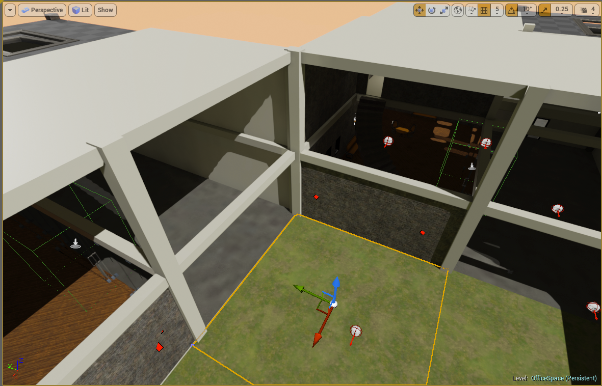
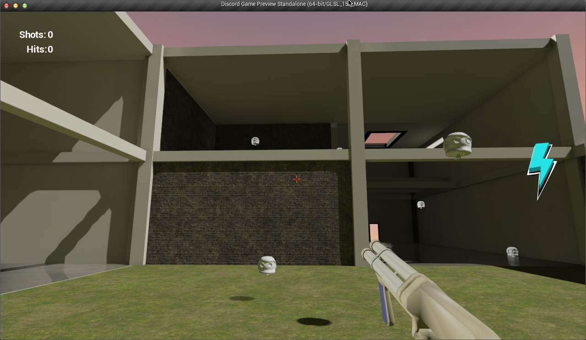
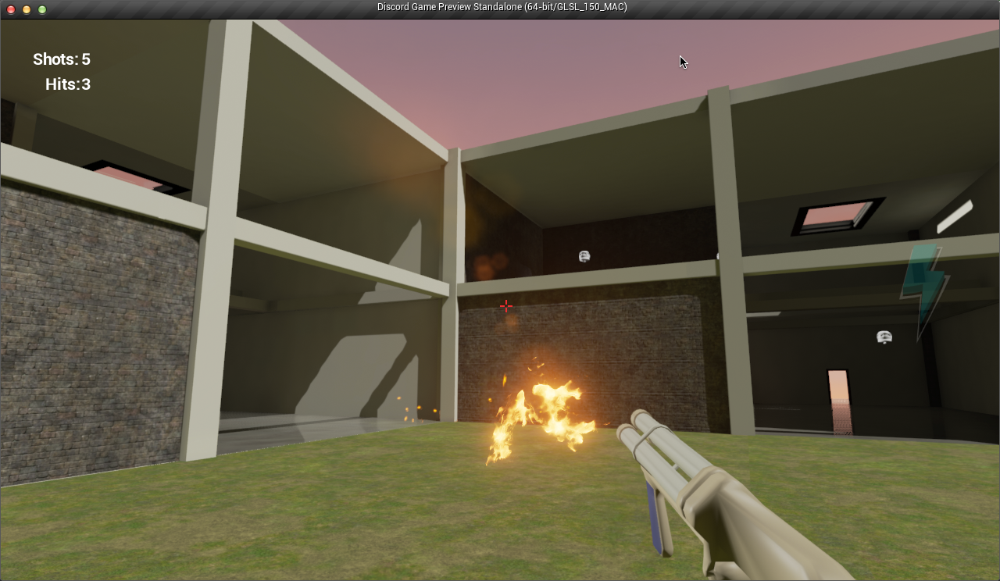

ComputeMW2014-Discord
=====================

Hacakthon project from Compute Midwest 2014, done in Unreal Engine 4.5.1 ;) The basic premise is that you shoot cats at enemies. When a cat hits an enemy, they both go up in a fiery explosion and the cat releases a horrible meow. It's delightful, really. 

A friend and I created this game for the Compute Midwest 2014 hackathon in Kansas City. We didn't end up implementing any API's (through the VaRest plguin), but we still had a good time creating a basically functional game. The plugin is included and compiled for OSX because I was messing around with it, but nothing in the final version.

If you are new to Unreal Engine 4 or just a developer trying to see some good examples of specific functionality and setup, there may be something here for you.

Some game features that may be of interest:
* Custom projectile (a cat, to be precise) & gun
* Ammo clip limitations (6 shots before reload)
* Responsive UI that displays reload message and an image whose alpha value represents the number of shots remaining
* UMG HUD to track and display shots fired and shots hit
* Did I mention that you shoot cats, which explode on impact with ghost-like creatures, letting forth a tortured meowing?

###Level Overview

###In Game

###In Game

